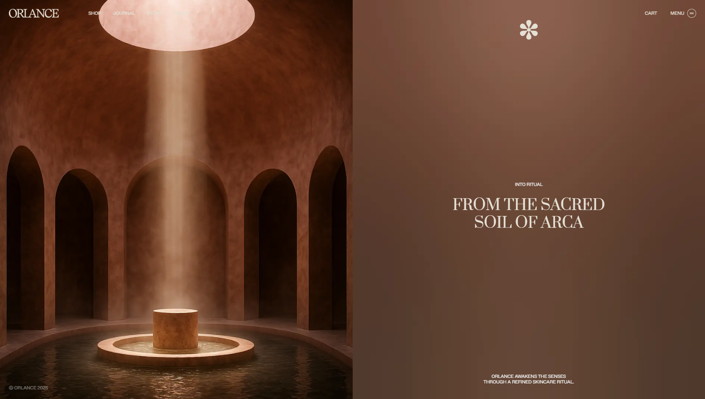

# Pixel-Perfect клон шаблона Orlance Webflow

1:1, пиксель-перфект клон шаблона **Orlance** от **STUDIOP DIGITAL DESIGN**.
Весь дизайн и ассеты остаются © **STUDIOP DIGITAL DESIGN** и используются здесь исключительно в демонстрационных целях.

## Посетите [Live Demo](https://orlance.vercel.app), чтобы посмотреть

[https://orlance.vercel.app](https://orlance.vercel.app)

## Возможности

13-страничный, пиксель-перфект сайт, созданный с использованием **Next.js**, **React** и **TypeScript**

Полностью функциональная корзина покупок с использованием **React Context**, кастомных хуков и **localStorage** (SSR-safe)

Плавные анимации с помощью **Framer Motion**

Оптимизация изображений с использованием **Next.js** `<Image>` для лучшей производительности

Динамическая генерация карточек товаров из массива данных через props и `Array.prototype.map`

Слайдер изображений с использованием **Swiper.js**

Исправления багов оригинального шаблона — подробнее ниже

## Технологический стек

* Next.js
* React
* TypeScript
* Tailwind CSS
* Framer Motion
* Swiper.js

## Исправления багов и улучшения

**Исправлено «ломание» сетки карточек товаров**

> Добавлен `h-full` ко всем элементам карточек, применён
> `<Code>grid-auto-rows: minmax(0, 1fr)</Code>` к контейнеру сетки

**Исправлено срабатывание hover-состояния только на изображении, а не на всей карточке товара**

> Ссылка карточки обёрнута в контейнер `group`, изображению добавлен `group-hover`

**Исправлена навигация «Read Next» (1→2, 2→3, 3→1, 4→1)**

> Третья статья теперь ведёт к четвёртой (1→2→3→4→1), корректно замыкая цикл.

**Исправлено несоответствие количества товаров в корзине в разных хедерах**

> Один хедер отображал количество уникальных позиций, другой — общее количество товаров

> Unified all headers cart buttons to display distinct items
